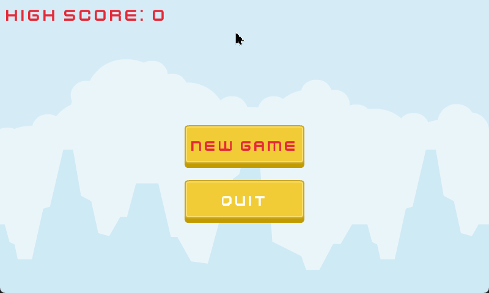

## CTappy

### Description

This is simple clone of [Flappy bird](https://20_games_challenge.gitlab.io/games/flappy/) made for [20 Games Challenge](https://20_games_challenge.gitlab.io/). Made with [Raylib](https://www.raylib.com/). 

### Features

 - Endless obstacles randomly generated 
 - Simple plane animation
 - Score and Highscore
 - Gameover screen

### Controls

Keyboard:
 - Space to jump / select in menu
 - UP/DOWN to change selection in menu

 ### How to play

Download windows binaries from [releases](https://github.com/asikora/ctappy-raylib/releases). 

### How to compile 

Clone the repo and open the workspace in VS Code. Alternatively use makefile to compile. 

### Developers

 - Adam Sikora

### License

This game sources are licensed under an unmodified GPL3 license. Check [LICENSE](LICENSE) for further details. Assets are from https://www.kenney.nl/ licensed under [CC0 license](assets/license.txt).